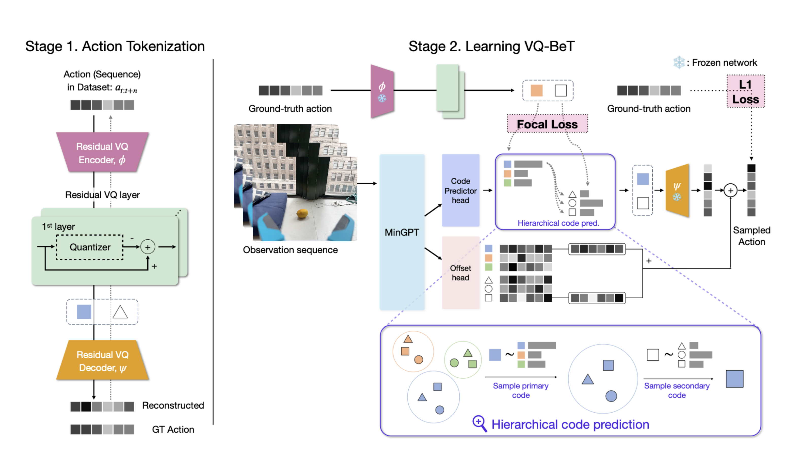

# Intro/Motivation
## Context {Furkan}
TODO: <Flowcharts/graphs>
Robot Utility Models are... <brief and concise description of RUMs>

## Project Objectives
Robot Utility Models (RUM) have demonstrated its ability to complete individual short-term tasks and generalize robustly to out of distribution environments via behaviour cloning. We seek to investigate and expand the capabilities of RUM in regards to multimodality and task complexity.

RUMs uses BeT, which has been shown to be able to learn multimodal actions. We aim to test the extent of this capability with a distinctly multimodal task: sorting items based on their visual appearance into location-specific receptacles. RUMs has not yet been tested on such an explicitly forked task conditioned on visual indicators.

It is plausible that RUMs could handle longer, complex tasks with accordingly longer and more complex expert demonstrations, but each task would require a new dataset, and collecting these demonstrations would take exponentially longer due to the greater degree of total variety required for a robust policy. Longer tasks are often able to be decomposed into shorter, simpler subtasks. The same subtask may also be present in many different complex tasks. Therefore, our second objective is to implement task composition.

Finally, the current deployment procedure requires the user to first carefully position the robot and align the camera with the task scene. We explore methods of reducing the dependence on human intervention, such as automated navigation.

## Expected Contributions
The expected contributions of the project include:

1. A robust visually-conditioned sorting policy.
2. An implementation of task composition.
3. The integration of navigation capabilities with RUMs

# Experiments/Processes
## Describe initial ideation stage (cups/cabinet stuff) {Alex}
The project started with an idea curation phase, where the current RUM is able to pick up bag and tissue, open door and drawer, and reorient fallen objects on the table. Given our proposal to extend RUM's capability and to explore more complex home tasks, our idea is to first select a task that is adjacent to established possible tasks, and then compose that task with some natural extension. 

In terms of task selection, our first idea is to have a bottle/can/cup pick up policy, and the composition task will be placing cups in cabinet. Here we will train: a) a cup pickup policy, b) a cabinet open policy, c) a cup placing policy. The main obstacle here is navigation and object occlusion: while pick up by itself should be straight forward, interacting with the cabinet requires acting at different height and placing cups require overcoming occlusion caused by the form factor of cups. Other natural tasks, such as taking cans out of the fridge, have simliar navigational challenges. We therefore realized that a more suitable task would invovle common objects, preferably those small in size so as to reduce occlusion, and a compositional task that requries minimal navigation. Picking fruits naturally came up, and we decided that we will have a pick up policy for lemon and lime, and the compositional task will be sorting them. More detailed description and variations are presented below. [insert image for cup pick up to demonstrate occlusion]

Besides task selection, we also need to overcome the technical challenge of task composition, as this was not previously implemented. Our goal is to have a general, policy independent way of composing arbitrary policies, as this will allow arbitrary extension of task complexity, as long as the tasks are compositional. There were discussions on techniques to achieve that, below we present two alignment methods, one compares image encoding similarity while the other uses DynaMem.  

## Lemon pickup policy {Alex}
This is the first policy we trained, where we familiarized ourselves with the data collection procedure, and this policy can be seen as replicating existing result, since it is just a simple pick up task, like those already trained. From conversation with Mahi and Haritheja, we understood we needed roughly 500 demos to learn a lemon pick up policy, so we collected lemon pick up in various environments, some of the demos can be seen in the ``overview of policy training procedure'' section. Below we attach a successful policy rollout demonstration.
[film if not avaliable and attach gif]

## Lemon/lime sorting (left/right) {Alex/Jaron}
This task is the first variant of sorting lemon and lime, where the idea is heavily inspired from Mahi. It has the advantage of conceptually simple and easy to collect data while compared to the labeled bowls sorting it is less data efficient, see next section for more detail.

The task is as follows: the stretch robot starts with a lemon/lime in its gripper, with two containers in front of it, and the task is to put the lemon/lime in the left/right container respectively. Alternatively, this task can be seen as a placing policy that is condition on fruit variety where the placing locaiton is fixed, in the next variant the we relaxes the second constraint. This task can also be seen as a combination of two separate task where each sorts lemon and lime respectively, and in that case one could imagine using a higher level policy to decide which sub-policy to trigger. The environmental diversity/out of distribution generalization comes in the form of a) different containers, b) different table top, c) different approach directions. While lemon and lime also comes in variations, the variations are much more minor than that of the other factors. In our data collection, to insure robustness, we made sure to consider variation and combination of the containers, such as swapping the left and right container, and we made sure to use different table top to record our demo. We also had different appraoch directions, though at the present moment whether we have under-collected the number of demos given our dataset diversity, more discussion in the results/conclusion section. 

Our first training involved around 1.5k demos, however that seems to not be enough, a further 1k demos is collected and the training is currently underway; we also had some hiccups during trainig because of data preprocessing and gpu availability, more discussion in the results/conclusion section. Below we show some test environment rollout and some sample of collected demos.

[insert demo for rollout and sample collected demos]

## Lemon/Lime Sorting with Labeled Bowls {Jaron}
The first sorting policy is visually conditioned to direct an object to a set relative location (left/right). An interesting alternative is where the sorting destination is not fixed. Rather than sorting lemons and limes into the left and right bowls, respectively, lemons and limes are more flexibly sorted into corresponding labeled bowls. Picture 'lemon' and 'lime' signs affixed to each bowl.

Two problems with the implementation of this task are that 1: It appears to require double the training data as the previous version, as we now need to demonstrate sorting each fruit into the other bowl, and 2: There are still significant inflexibilities - what if we need to make modifications to the labels we select for lemons and limes, or would also like to sort oranges?

### Tailored Image Augmentations
We suggest that the increased training data acquisition may be avoided by using targeted image augmentations.
The training demonstrations can be performed such that we are able to substitute the labels and the sorted item after-the-fact using image processing operations.

From these "generic" demonstrations, we can produce demonstrations of sorting lemons by changing the sign on the destination bowl to appear as the lemon label and color-shifting the held fruit to resemble a lemon. We can likewise produce demonstrations of sorting limes by changing the sign to the lime label and color-shifting the held fruit to resemble a lime.

To facilitate label substitution, the physical labels used while taking training demonstrations are ARUCO fiducials. The held item is always a lemon, and during demonstration is placed into either the left or right bowl. The same ARUCO marker is always placed on the bowl in which the lemon is placed. With this procedure, lemon-sorting demonstrations can be produced by drawing the lemon label atop the ARUCO marker, and lime-sorting demonstrations can be produced by inserting the lime label and color-shifting the lemon.

## Image Encoding-based alignment {Jaron}
### Motivation
Given working RUM policies for various simple tasks, the objective of composing compound tasks requires a robust method of chaining them together. The behavior of each individual task policy is sensitive to the deployment environment. If the model receives out-of-distribution observations, we can expect it to perform poorly. Thus, it is important that the robot realign itself after completing a chained task such that the following chained task is presented with an environment compatible with its training.

For example, suppose the robot is instructed to pick up a lemon and place it in a bowl. First, the robot should align its camera so that a lemon is in view. Second, deploy the lemon-pickup policy. Third, align the camera with a bowl. Fourth, deploy the place-lemon-in-bowl policy.

We attempt to devise an implementation of the alignment function that does not require additional data collection and can be run locally on the robot.

### Demonstration

  

### Implementation
Our image encoding-based alignment strategy is as follows:
1. Distill a representation of the start state of a task from the first few frames of each training demonstrations.
2. During deployment, scan the surroundings for the camera frames that most closely match the distilled start state representation.
3. Maneuver the robot towards the orientation that produced the closest match.

We use the pretrained dino-vits16 image encoder to encode the reference and scan images. The start state representation is simply the average of the encodings of the first few frames of each training demonstration. This process is repeated for both the RGB and depth images to produce two independent references which have weighted relative importance.

During a scan, images and the angles at which they were taken are recorded in a buffer class. Then, the images are encoded and scored by their cosine similarity to the references. The angle selection process involves binning the closest matches at small angle increments and selecting the bin with the highest match rate (normalized to account for variable reading density).

An example of a 360° scan that passes over a lemon and the frame taken at the scan angle closest to the selected angle of 315°.

  
  

The selected angle was chosen after scoring each frame and then performing the binning procedure.

  
  

The encoder choice and methodology were chosen after experimenting with multiple options. A standalone repository containing the experimental code is located at https://github.com/jaron-cui/camera-frame-alignment.

## DynaMem-based alignment {Akshat}
## Navigation {Akshat}
## Overview of policy training procedure (data collection -> training -> deployment) {Alex/Furkan}

  

  Figure 1: Training and Deployment

In the 1st step we collected videos for for picking up the lemons, sorting the lemons, and sorting the limes in different environments. 

An example of the video for picking up the lemon and sorting the lemon be seen in the pictures below. 

  
  
  
  
  

   Figure 2: Lemon Pick Up

  
  
  
  
  

  Figure 3: Lemon Sorting

After collecting the demos, which roughly takes $\mathcal{O}(1)$ hours, it is the data preprocessing and training stage.

During data preprocessing, video is compressed, and a seven dimensional action vector is extracted, which includes three that parameterizes linear motion and four that parameterizes rotation (quaternions) and a gripper value. It turns out that extrating the gripper width can be difficult at times and not entirely robust to novel situations, we encountered some difficulties there.

The training stage is two fold, the first step is using a clustering algorithm to discretize the action (vqvae), and the second stage is training the behavior transformer (vqbet) using this discretization. Notebly, the first stage have a gpu speed up but have very low gpu usage, so it is not Greene friendly. The second stage roughly takes 4 rtx8000 in <5 days.

Deployment is rather straightforward where we move the model weights to the stretch robot and run deployment code. There is a nice UI that we have used and modified for our project.

## Data collection {Jaron}

## Training {Furkan}

  

  Figure 4: VQ-BeT Training

After the videos are collected, they are compressed, and translation (linear movement of the robot's gripper), rotation (how the gripper is rotated in space relative to a reference frame), gripper values (representing how open or closed the gripper is while holding a lemon or lime) that were collected during the video recording are extracted. 

### Stage 1. Action Tokenization

The translation (x, y, z), rotation ($q_x$, $q_y$, $q_z$, $q_w$), and gripper (g) values that are extracted from each frame for each video are used as actions. When we want to perform a certain task, there are often multiple ways to do it. Transformer-based models are very good at capturing this multi-modality and associating different and relevant parts of the input with each other. However, transformer-based models usually work with discrete data. To train a language model, for instance, the text is split into discrete units named tokens, these tokens are converted into embedding vectors to represent each token with a vector (list of numbers), and these embedding vectors are transformed further with another linear layer. In our case, the action values are all continuous. So, to make these continuous actions compatible with a transformer model, we need to tokenize them. 

There are different ways to do this. One way is to simply use K-Means clustering to cluster the continuous actions and treat each cluster as a discrete unit/token. However, this method is inefficient for high-dimensional action spaces. It doesn't scale well for long action sequences. It lacks gradient information and it struggles with modeling long-range dependencies in action sequences In addition, K-Means create hard boundaries between clusters. []

One other method that can used to tokenize the continuous actions is Vector Quantization. In this method, a neural network model is used to extract the features of the continous action values. This is called Residual VQ Encoder. In addition, a list of vectors is initialized randomly and these are called codebook vectors. A codebook vector can be seen as the discrete representation of the continuous action. There is also a process named quantization which is basically mapping the outputs of the RVQ Encoder to the nearest codebook vector.  

In VQ-BeT, multiple layers of quantization are used in such a way that the codebook in each layer captures more details about the continuous action that were missed in the previous layers. Assuming that we use $N$ layers, here is how the process works: 

1) After a continuous action is encoded into a latent vector $x$ by RVQ Encoder, this latent vector is compared with all vectors of the 1st codebook.
2) The codebook vector that is most similar to the latent vector $x$ is found and this codebook vector becomes the quantized output of the action in the 1st layer. The index of this codebook vector is called "primary code" for the input action.
3) The difference (residuals) between the latent vector $x$ and quantized output of the 1st layer is passed to the 2nd layer.
4) The codebook vector in the 2nd codebook that is closest to the residuals is found and the idnex of this codebook vector is called "secondary code" for the input action. 
4) This process continues until quantizing the residuals $N-1$ times.

Because the difference (residuals) between the continuous action $x$ and the quantized outputs from the previous layer(s) are used in each layer, this is called Residual Vector Quantization (RVQ). 

After this process is done, another neural network model tries to reconstruct the original continuous action from the quantized representations of each layer. This model is called the Residual VQ Decoder []. 

During the training of RVQ, the encoder outputs of different actions can be assigned to the same codebook vector. For updating that codebook vector, the average of all encoder outputs that are assigned to that codebook vector is taken and the codebook vector is updated as a weighted average. By using this approach, codebook vectors adapt to represent the distribution of actions over time. 

### Stage 2. Learning VQ-BeT

MinGPT is a minimal representation of the GPT that is used to predict the next token. In VQ-BeT, the sequence of image frames (observation sequence) extracted from the collected videos is used as input to MinGPT. The output of the MinGPT is used as input to a layer (Code Predictor head) and this layer produces a probability distribution over all possible primary codes (index of the codebook vector in the 1st codebook that is closest to the input action), a probability distribution over all possible secondary codes (index of the codebook in the 2nd codebook that is closest to the input action), etc. In other words, a probability distribution of the indices of the code vectors is predicted for each quantization layer.

Instead of choosing the code vector that was assigned the highest probability, a code vector is sampled from the probability distribution over all code vectors for each quantization layer. This introduces controlled randomness that allows exploration and helps the model avoid getting stuck in repetitive behaviors. Then the difference between the code vector predicted by the MinGPT and Code Predictor head based on the observation sequence and the code vector that is assigned to the observation sequence by the RVQ are minimized for each quantization layer. 

In addition, the codebook vectors that are predicted by the MinGPT and Code Prediction head for each qunatization layer based on the sequence of observations are combined and decoded with RVQ Decoder that was trained in Stage 1.

Lastly, 

# Results/Conclusions
## Recap successes/failures of individual experiments/ideas + analysis
### Gripper opening/closing threshold hyperparameter tuning
During deployment, the model predicts a gripper value, and if that value passes a threshold then the gripper acts to close/open. The policy performance crucially depends on this threshold, which is a hyperparameter in deployment, and one observes in practice that sometimes failure occurs because the threshold is $\epsilon$ above the predicted gripper value and that the gripper value does not necessarily moves in a smooth manner. If this is not due to the policy being undertrained, I wonder if there is a more nature, smoother way to gate gripper behavior. 
### Gripper value problem
It turns out Greene is gpu poor for the students, and since all steps in the training stage requires GPU disjointly it adds to the overhead and wait time. While we had minor problems with quaternion parameterization, the biggest inconsistency seems to be gripper value extraction. It seems to me that using a smaller gripper did not change gripper value extraction, but having the gripper started off open, as in the sorting policy, really messed things up. One temporary fix is to invert the video in the gripper value extraction function as that would make it look like a pick up policy. However this seems to not work as can be seen in the image below: [insert image].
### Occlusion problem
This is not the necessary reason that the policy is performing less than idea, but it is a speculation. Where in the sorting demos, we could see that a) the gripper object is out of focus and b) the target visual cue is sometimes occluded. While problem a does not affect us, one could image situations in which the blurred out texture of gripper object is not enough to differentiate it for the task (perhaps sorting bad lemon from good lemon). Problem b is more serious, where for example in the sorting policy, in the later steps, the information of the location of the gripper is only contained in the rim of the image. A potential solution is to use a longer effective observation horizon in inference, so that the policy can infer the location of the gripper using ``memory''. Due to time constraint this hypothesis remain untested.
## Implications of these successes/failures
## Future work?
## Acknowledgement

# References 

