# Intro/Motivation
## Context {Furkan}
TODO: <Flowcharts/graphs>
Robot Utility Models are... <brief and concise description of RUMs>

## Project Objectives
Robot Utility Models are able to complete individual short-term tasks by cloning expert demonstrations. We seek to investigate and expand the capabilities they provide in regards to multimodality and task complexity.

RUMs uses BeT, which has been shown to be able to learn multimodal actions. We aim to test the extent of this capability with a distinctly multimodal task: sorting items based on their visual appearance into location-specific receptacles. RUMs has not yet been tested on such an explicitly forked task conditioned on visual indicators.

It is plausible that RUMs could handle longer, complex tasks with accordingly longer and more complex expert demonstrations, but each task would require a new dataset, and collecting these demonstrations would take exponentially longer due to the greater degree of total variety required for a robust policy. Longer tasks are often able to be decomposed into shorter, simpler subtasks. The same subtask may also be present in many different complex tasks. Therefore, our second objective is to implement task composition.

Finally, the current deployment procedure requires the user to first carefully position the robot and align the camera with the task scene. We explore methods of reducing the dependence on human intervention, such as automated navigation.

## Expected Contributions
The expected contributions of the project include:

1. A robust visually-conditioned sorting policy.
2. An implementation of task composition.
3. The integration of navigation capabilities with RUMs

# Experiments/Processes
## Describe initial ideation stage (cups/cabinet stuff) {Alex}
## Lemon pickup policy {Alex}
## Lemon/lime sorting (left/right) {Alex/Jaron}
## Lemon/Lime Sorting with Labeled Bowls {Jaron}
The first sorting policy is visually conditioned to direct an object to a set relative location (left/right). An interesting alternative is where the sorting destination is not fixed. Rather than sorting lemons and limes into the left and right bowls, respectively, lemons and limes are more flexibly sorted into corresponding labeled bowls. Picture 'lemon' and 'lime' signs affixed to each bowl.

Two problems with the implementation of this task are that 1: It appears to require double the training data as the previous version, as we now need to demonstrate sorting each fruit into the other bowl, and 2: There are still significant inflexibilities - what if we need to make modifications to the labels we select for lemons and limes, or would also like to sort oranges?

### Tailored Image Augmentations
We suggest that the increased training data acquisition may be avoided by using targeted image augmentations.
The training demonstrations can be performed such that we are able to substitute the labels and the sorted item after-the-fact using image processing operations.

From these "generic" demonstrations, we can produce demonstrations of sorting lemons by changing the sign on the destination bowl to appear as the lemon label and color-shifting the held fruit to resemble a lemon. We can likewise produce demonstrations of sorting limes by changing the sign to the lime label and color-shifting the held fruit to resemble a lime.

To facilitate label substitution, the physical labels used while taking training demonstrations are ARUCO fiducials. The held item is always a lemon, and during demonstration is placed into either the left or right bowl. The same ARUCO marker is always placed on the bowl in which the lemon is placed. With this procedure, lemon-sorting demonstrations can be produced by drawing the lemon label atop the ARUCO marker, and lime-sorting demonstrations can be produced by inserting the lime label and color-shifting the lemon.

## Encoding-based alignment {Jaron}
## DynaMem-based alignment {Akshat}
## Navigation {Akshat}
## Overview of policy training procedure (data collection -> training -> deployment) {Alex/Furkan}

<figure style="text-align: center;">
  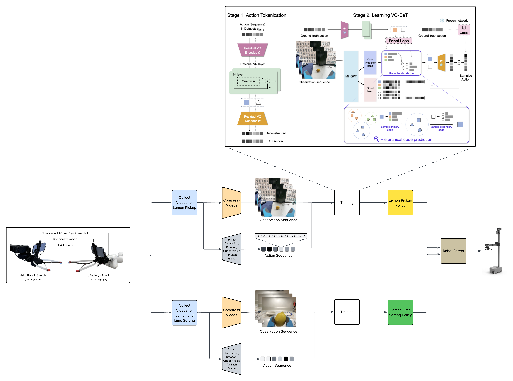
  <figcaption>Figure 1: Training and Deployment</figcaption>
</figure>

In the 1st step we collected videos for for picking up the lemons, sorting the lemons, and sorting the limes in different environments. 

An example of the video for picking up the lemon and sorting the lemon be seen in the pictures below. 

<figure style="text-align: center;">
  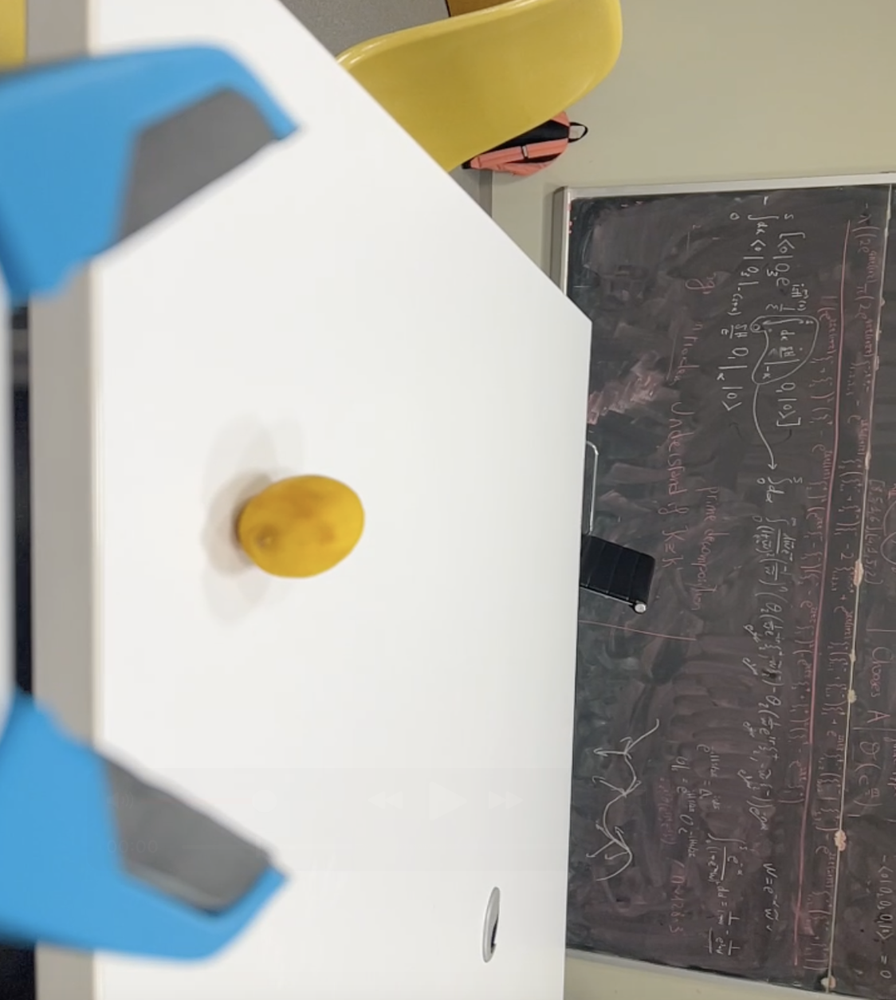
  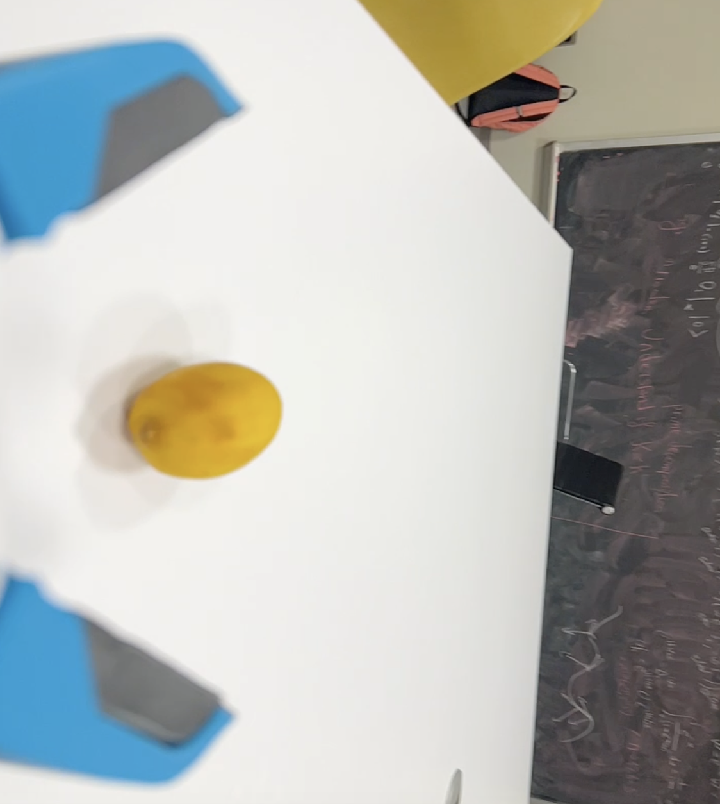
  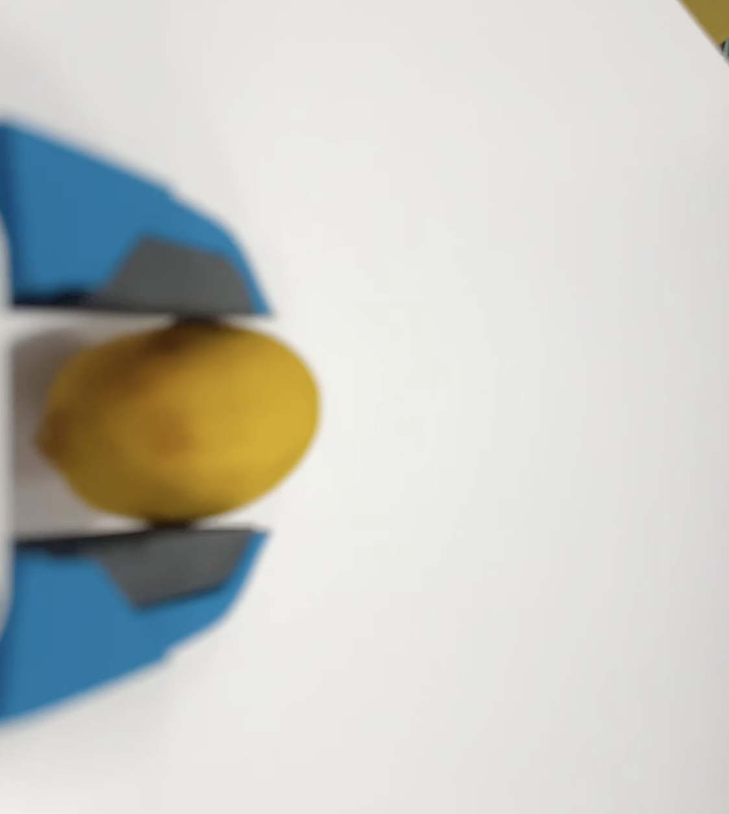
  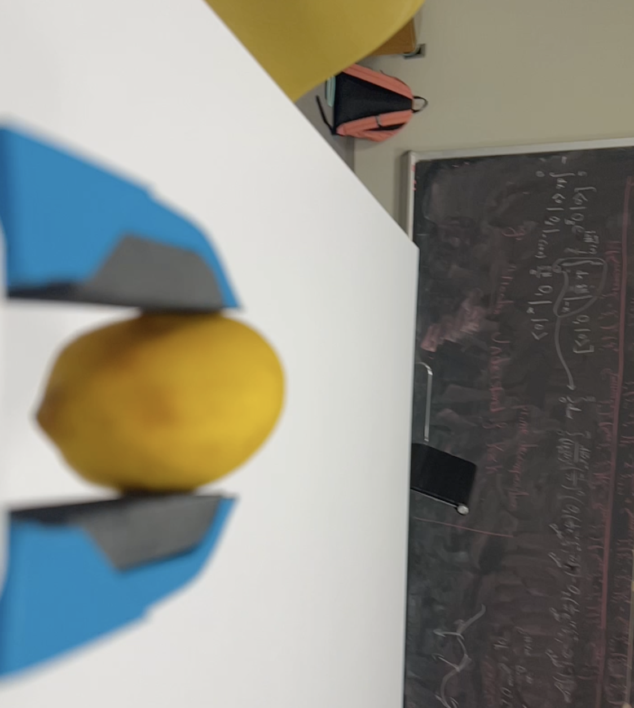
  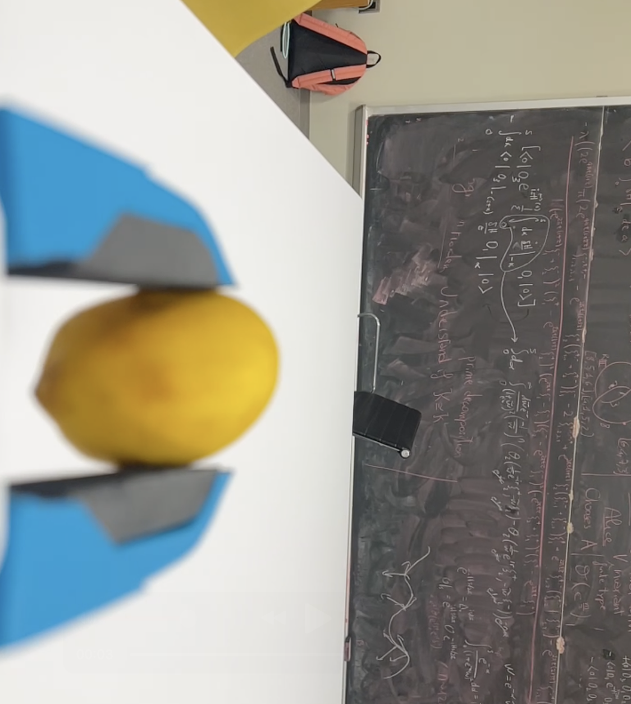
  <figcaption>Figure 2: Lemon Pick Up</figcaption>
</figure>

<figure style="text-align: center;">
  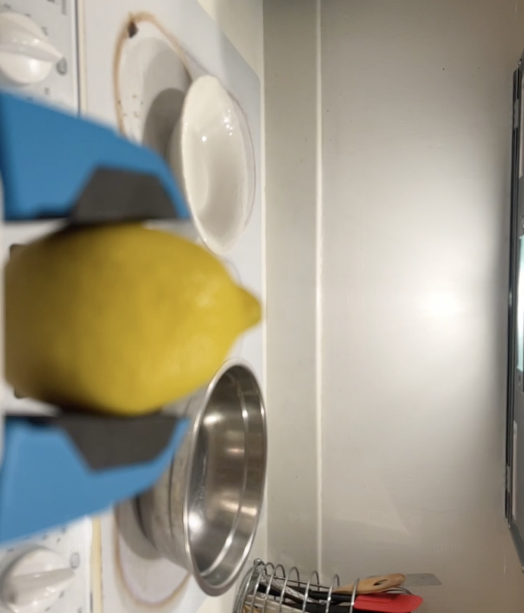
  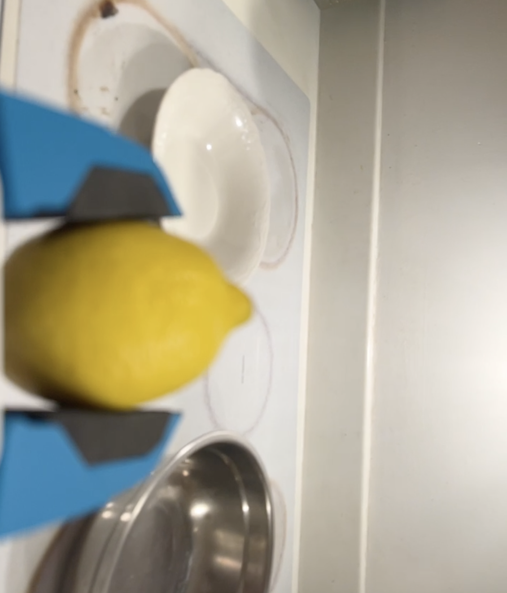
  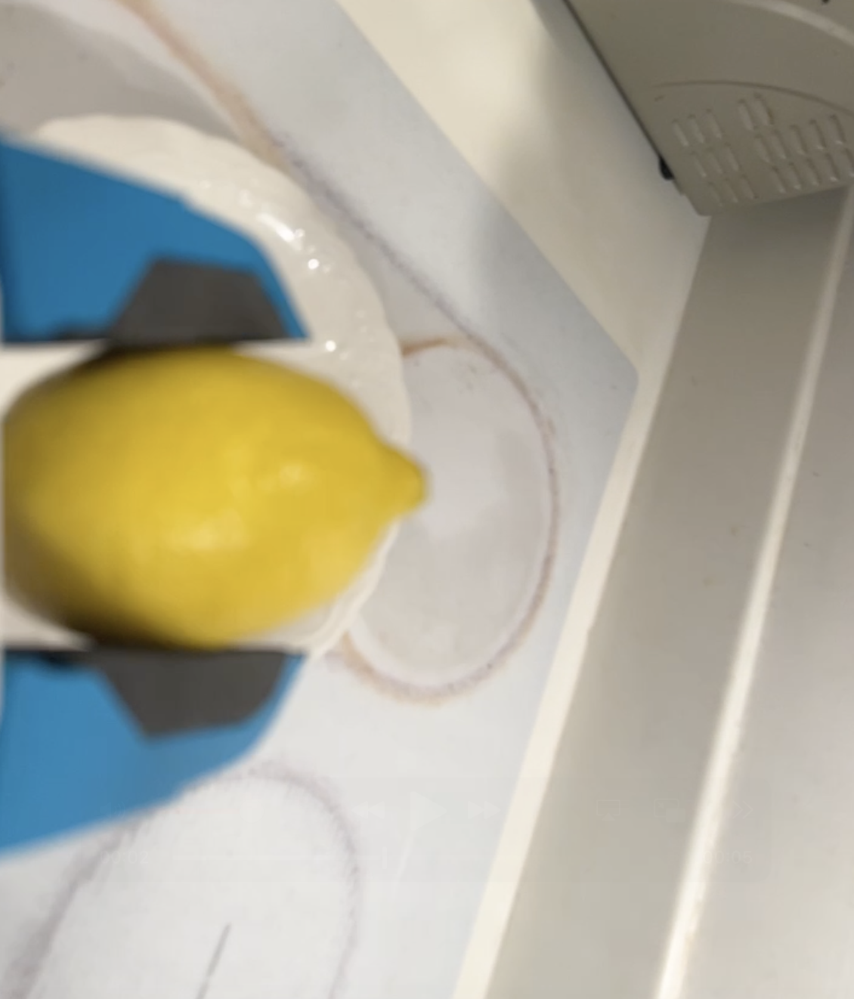
  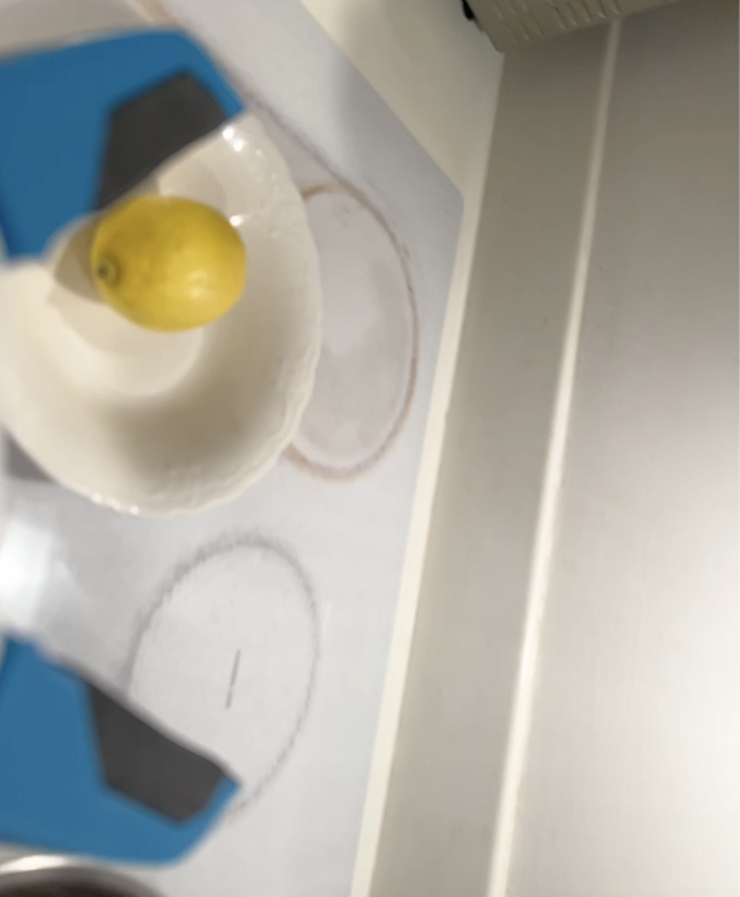
  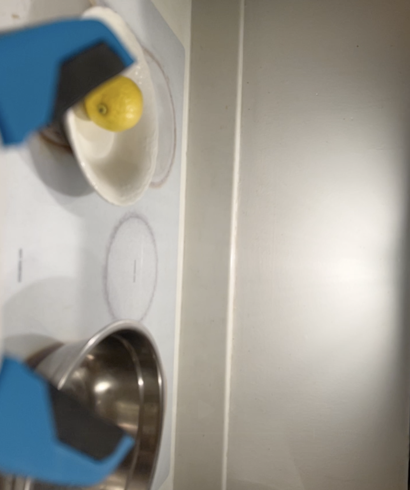
  <figcaption>Figure 3: Lemon Sorting</figcaption>

## Data collection {Jaron}

## Training {Furkan}

<figure style="text-align: center;">
  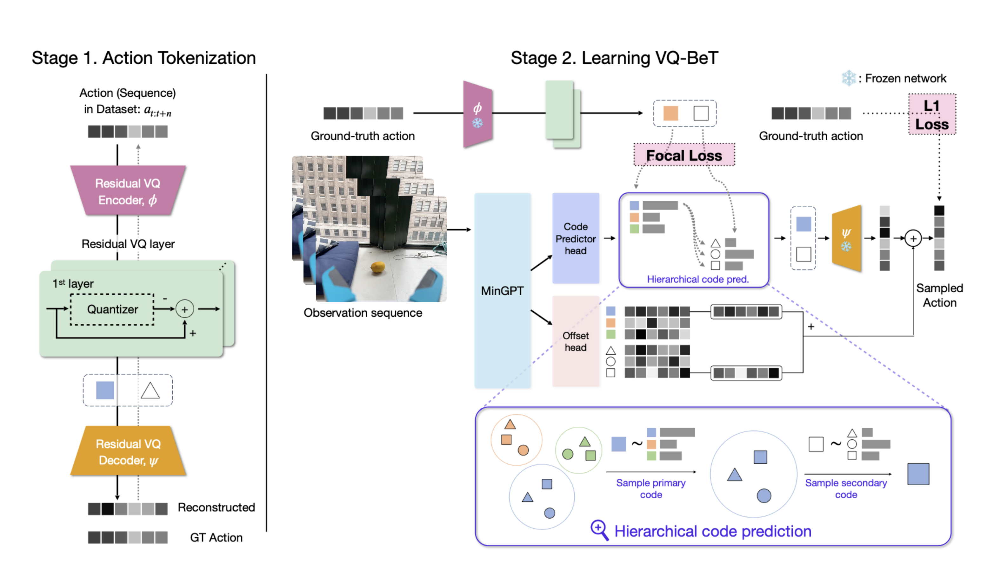
  <figcaption>Figure 4: Rum Training</figcaption>
</figure>

# Results/Conclusions
## Recap successes/failures of individual experiments/ideas + analysis
TODO: Add respective notes into this section
## Implications of these successes/failures
## Future work?

